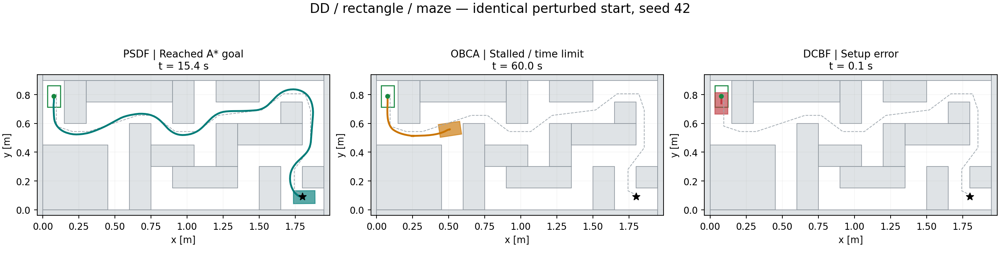
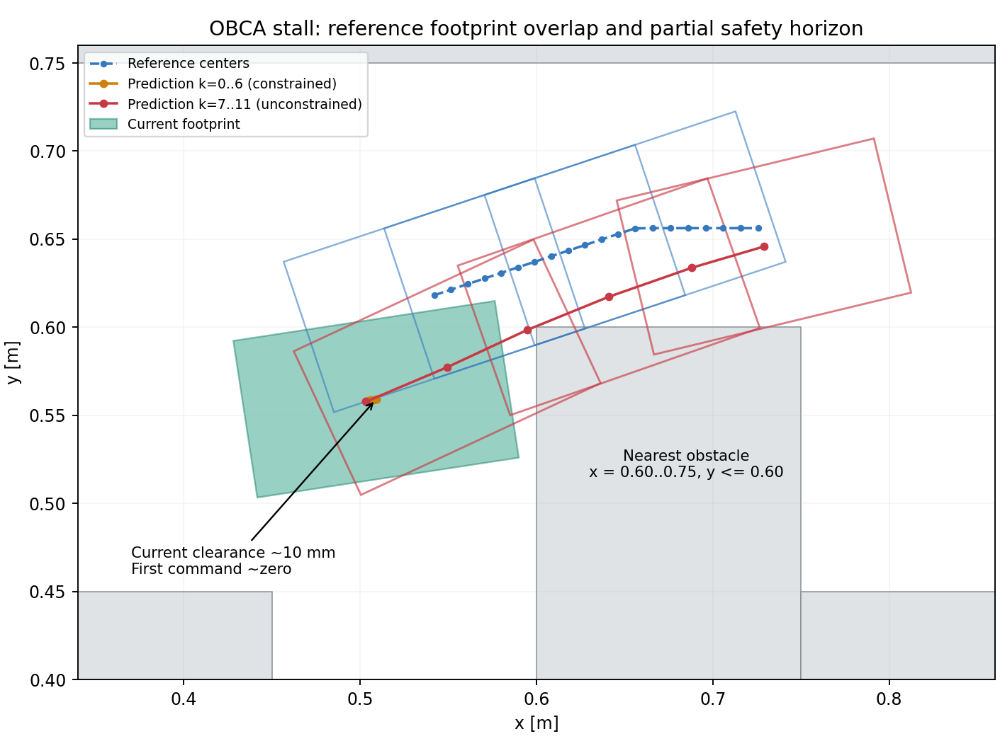

# Navigation comparison: DD / rectangle / maze

실행일: 2026-09-07. 각 방법 1회, 동일 seed 42. 기본 optimizer 설정을 그대로 사용했다.

- 실제 시작 pose: `[0.07652358539877216, 0.7898000794687975, -1.5707963267948966]` (m, m, rad).
- 시작 변동량: `[0.0015235853987721568, -0.005199920531202478, 0.0]`. x/y sigma 5 mm, heading 고정, 3-sigma 제한.
- 공통 초기 footprint clearance: **28.476 mm**.
- DD, rectangle 150 x 90 mm, maze, A* + constant-speed reference, dt 0.1 s, 최대 주행 시간 60 s.
- Localization noise는 껐다. 출력과 acados 생성 코드는 controller별 독립 폴더에 저장했다.

| Controller | 결과 | 시뮬레이션 시간 | 환경 goal까지 거리 | 최소 기록 clearance | 영상 |
| --- | --- | ---: | ---: | ---: | --- |
| PSDF | A* goal 도착 | 15.4 s | 0.0127 m | 0.310 mm | [MP4](psdf/animations/psdf/MPC_psdf_rectangle_maze_startseed42.mp4) |
| OBCA | 정체 후 시간 초과 | 60.0 s | 1.3735 m | 10.003 mm | [MP4](obca/animations/obca/MPC_OBCA_rectangle_maze_startseed42.mp4) |
| DCBF | 거리계산 setup 오류 | 0.1 s | 1.8421 m | 28.476 mm | [MP4](dcbf/animations/dcbf/MPC_DCBF_rectangle_maze_startseed42_failed.mp4) |



## PSDF

154개 제어 step 후 기존 도착 판정으로 성공했다. 기록 pose에서는 충돌을 검출하지 않았다. 최소 clearance는 약 0.310 mm로 작다.
성공 판정은 A* 경로의 마지막 grid 점까지 10 mm 이내인지 확인한다. 이 실행에서는 grid 목표까지 9.068 mm, 원래 환경 goal까지 12.675 mm였다. 따라서 원래 goal 10 mm 이내 도달이라고 해석해서는 안 된다.

## DCBF 실패 원인

`dcbf` 옵션은 기존 `NmpcDcbfOptimizerSqp`를 사용한다. 첫 solve는 status 0이며 `[v, omega] = [0.49452465, 0]`를 적용했다. t=0.1 s의 다음 setup에서 CasADi `Psd constraints not implemented yet` 오류가 발생했다. 이때 실제 footprint clearance는 약 28.476 mm로 초기 충돌이나 거리 부족에 의한 infeasibility가 아니다.

`control/dcbf_optimizer_sqp.py`의 `b_robot_curr = A_robot @ R_curr.T @ self.state._x[0:2] + b_robot`에서 `(4,) + (4,1)`이 `(4,4)`로 broadcasting된다. CasADi가 이를 원소별 선형 부등식 대신 행렬 PSD 제약으로 해석한다. 원래 nominal pose에서도 같은 오류를 별도로 재현했다.
첫 step 이전에는 장애물 필터 반경이 0.0125 m이고, 첫 입력 적용 후에는 0.276615 m로 커진다. 따라서 다음 setup에서 그동안 건너뛰던 잘못된 geometry 변환 경로가 실행된다.

추가로 실제 생성 OCP의 `nh=nh_0=nh_e=0`, `ng=0`을 확인했다. `create_solver()` 이후에 회피 제약을 추가하며, nonlinear 제약을 `constraints.expr_h/lg/ug`로 넣고 있어 생성된 solver에 반영되지 않는다. 즉 shape 오류만 고쳐도 올바른 DCBF 비교 구현이 되는 것은 아니다. `z`를 dual 변수로 선언하면서 `f_impl_expr`에 `z` 자체를 넣어 0으로 강제하는 모델링도 재검토가 필요하다.

증거: [shape 재현](dcbf_shape_diagnosis.json), [실제 생성 OCP](dcbf/compiled_ocp_evidence.json), [실행 로그](dcbf.log). DCBF MP4는 실행된 한 step만 포함하므로 0.2초 길이이다.

## OBCA 실패 원인

`obca` 옵션은 요청한 파일의 `OBCAOptimizer`를 직접 사용했다. 60초까지 solver는 성공을 반환했지만 pose 약 `(0.509065, 0.559113, 0.151505)`에서 정체했다. 10초 이후 실제 이동 거리 합은 0.5413 mm였다.

해당 pose에서 동일 참조·OCP를 재구성한 결과 첫 입력은 `v=4.46e-9 m/s`, `omega=-1.33e-7 rad/s`로 거의 0이었다. 가장 가까운 장애물은 `[0.60, 0.75] x [0.00, 0.60]`이고, footprint 여유는 약 10 mm로 활성 안전거리 경계에 걸려 있다.
참조 중심점 20개 중 앞 13개는 해당 heading으로 놓은 rectangle footprint가 장애물과 겹친다. 현재 A*의 30 mm point margin과 경로 heading이 전체 rectangle의 회전 여유를 보장하지 않는다.
또한 `horizon=11`인데 `horizon_dcbf=6`이므로 회피 제약은 예측 pose k=1..6에만 적용된다. 재구성한 해는 k=7..11에서 장애물과 겹치며, 첫 입력은 거의 0이고 이후에 후진·회전·전진하는 계획이다. 주행 중에는 첫 입력만 실행하므로 같은 계획을 반복하며 정체한다. 충돌하는 참조와 짧은 안전 horizon이 결합한 receding-horizon 정체로 해석된다. 단일 진단 solve로 각 요인의 독립적인 인과 효과까지 분리한 것은 아니다.



제공된 `obca_optimizer.py`의 다각형 제약에는 `omega * gamma ** (i+1) * (cbf_curr-margin_dist)`가 남아 있다. 따라서 이번 결과는 그 파일의 현 구현 결과이며 순수한 고정거리 OBCA baseline이라고 부르기 어렵다.
증거: [정체 지점 OCP·참조·예측 clearance](obca_corner_diagnosis.json), [실행 로그](obca.log).

## 수정 우선순위

1. DCBF: translation을 column으로 유지하고, solver 생성 전에 올바른 nonlinear constraint API로 제약을 연결한다. Dual 변수 모델링도 함께 검증한다.
2. OBCA: 전체 prediction horizon에 회피 제약을 적용하고, rectangle footprint의 코너 회전을 반영하는 reference를 만든다. 이후 warm start와 제약 경계 정체를 검증한다.
3. 논문용 비교 전에는 horizon, 입력 제한, clearance, cost/terminal weight, 도착 판정을 통일하거나 차이를 명시한다. 현재 PSDF와 OBCA는 예를 들어 omega 한계가 1.2 vs 0.5 rad/s, horizon이 20 vs 11, safety distance가 0.1 vs 10 mm로 다르다.

이번 작업에서는 요청한 OBCA 옵션 연결과 실험·진단을 수행했고, 비교 결과가 바뀌는 optimizer 수식이나 tuning은 수정하지 않았다. 표의 clearance는 기록된 0.1초 pose에서 계산한 값이며 연속 시간 swept-volume 충돌 보증은 아니다. 각 방법 1회 결과이므로 성공률 통계로 해석하지 않는다.

## 재현

```bash
export ACADOS_SOURCE_DIR=/home/taek111/projects/acados
export LD_LIBRARY_PATH="$ACADOS_SOURCE_DIR/lib:${LD_LIBRARY_PATH:-}"
export MPLBACKEND=Agg
python benchmark_runs/navigation_comparison_20260907_seed42/run_one.py psdf
python benchmark_runs/navigation_comparison_20260907_seed42/run_one.py obca
python benchmark_runs/navigation_comparison_20260907_seed42/run_one.py dcbf
```

실행 Python: `/home/taek111/anaconda3/envs/ped/bin/python`. 각 controller 폴더에 config, result, trajectory.npz, trial CSV, start-pose JSON, MP4가 저장된다. 같은 폴더에서 다시 실행하면 해당 실험 출력이 갱신된다.

일반 단일 실험 옵션은 `python test_nmpc.py --single --optimizer-type obca --dynamics-type differential_drive --robot-shape rectangle --maze-type maze --perturb-start --start-seed 42`이다. 실패한 실행의 partial 영상까지 자동 보존하는 재현은 위 `run_one.py`를 사용한다.
