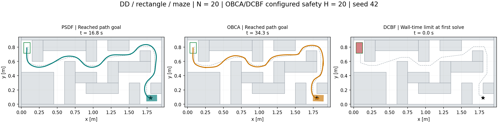
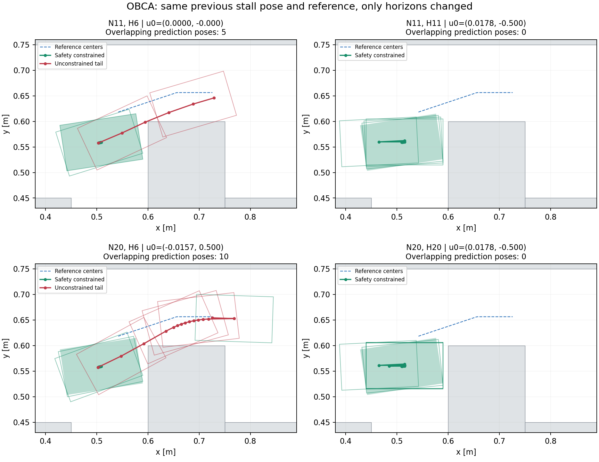

# Horizon 20 navigation 재실험

실행일: 2026-09-07. DD / rectangle / maze에서 각 방법 1회, 동일 seed 42로 실행했다.

- 예측 horizon: 모두 **20**, dt **0.1 s**, 예측 시간 **2 s**. OBCA/DCBF 안전 horizon도 모두 **20**이다.
- 사용자 수정본 `control/psdf_optimizer.py`를 사용했다. 이번 변경은 OBCA와 DCBF SQP의 horizon 기본값이며 PSDF 소스와 나머지 optimizer 수식은 보존했다.
- Rectangle 150 × 90 mm, A* + constant-speed reference, localization noise OFF, 최대 주행 시간 60 s.
- Gaussian x/y sigma 5 mm, heading 고정. 시작 perturbation: dx=1.5236 mm, dy=-5.1999 mm. 초기 clearance 28.476 mm.
- 모든 본 실험은 `pp` Python 3.10.13 / NumPy 2.2.5 / Torch 2.4.1 / CasADi 3.7.0 / l4casadi 2.0.0 환경에서 실행했다. 변경된 PSDF의 l4casadi 의존성 때문에 이 환경을 사용했다.

| Controller | 결과 | 주행 시간 | 완료 step | 최소 기록 clearance | 영상 |
| --- | --- | ---: | ---: | ---: | --- |
| PSDF | 경로 목표 도달 | 16.8 s | 168 | 0.410 mm | [MP4](psdf_pp/animations/psdf/MPC_psdf_rectangle_maze_startseed42.mp4) |
| OBCA | 경로 목표 도달 | 34.3 s | 343 | 10.255 mm | [MP4](obca_pp_continued/animations/obca/MPC_OBCA_rectangle_maze_startseed42.mp4) |
| DCBF | 첫 solve 중 실행 시간 제한 | 0.0 s | 0 | 28.476 mm | [MP4](dcbf_pp/animations/dcbf/MPC_DCBF_rectangle_maze_startseed42_failed.mp4) |



## PSDF 결과

수정된 PSDF는 168 step, 16.8 s에 기존 경로 목표 도달 판정으로 성공했다. 최소 기록 clearance는 0.410 mm이며 기록 pose에서 충돌은 검출되지 않았다.
도착 기준은 A* 마지막 경로 점으로부터 10 mm 이내이다. 이 실행의 경로 목표 오차는 9.354 mm, 원래 환경 목표 오차는 15.779 mm이다.

## OBCA: 이전 정체의 원인

이번 N=20/H=20 본 실험 결과는 **경로 목표 도달**, t=34.3 s이다. 이전의 첫 코너 정체 지점을 통과했다.
이전 정체 pose `(0.509065, 0.559113, 0.151505)`와 동일 reference를 고정하고 pp 환경에서 네 가지 OCP를 재구성했다. 나머지 수식·cost·입력 제한·warm start는 유지했다.

| 예측 N | 안전 H | 첫 v [m/s] | 첫 omega [rad/s] | 예측 footprint가 장애물과 겹치는 단계 |
| ---: | ---: | ---: | ---: | --- |
| 11 | 6 | 4.46371e-09 | -1.3305e-07 | 7, 8, 9, 10, 11 |
| 11 | 11 | 0.0177909 | -0.5 | 없음 |
| 20 | 6 | -0.0157446 | 0.5 | 7, 8, 9, 10, 11, 12, 13, 14, 15, 16 |
| 20 | 20 | 0.0177909 | -0.5 | 없음 |

기존 N=11/H=6에서는 첫 입력이 거의 0이고 k=7..11은 장애물을 통과한다. 실제 주행은 첫 입력만 실행하므로 정지 후 미래에 진행하는 같은 계획을 반복할 수 있다. N만 20으로 늘리고 H=6을 유지하면 k=7..16의 충돌 계획은 남는다. 반대로 N=11에서도 H=11로 늘리면 충돌하는 꼬리 구간이 제거되고 첫 회전 명령이 나온다. 따라서 **안전 horizon이 예측 horizon보다 짧은 설정이 이전 정체와 비현실적인 예측 계획의 핵심 원인**이라는 직접적인 증거다.
이 결론은 해당 정체 OCP의 통제 비교와 새 본 실험에 한정한다. 네 설정을 모두 끝까지 주행해 성공률을 비교한 실험은 아니다.
동일 reference 20개 중 13개는 해당 heading으로 rectangle을 놓으면 장애물과 겹친다. A*의 point margin 30 mm가 회전하는 전체 footprint의 통과 여유를 보장하지 않아 tracking cost와 회피 제약이 충돌한다. 이 참조 문제는 H=20에서도 남으며, footprint를 고려한 참조가 후속 개선 대상이다.



제공된 `obca_optimizer.py`의 다각형 회피식에는 `omega * gamma**(i+1) * (cbf_curr-margin_dist)`가 들어 있다. 이번 OBCA 결과는 이 파일의 현 구현 결과이며, 고정 거리만 강제하는 순수 OBCA baseline과 구분해야 한다.
증거: [통제 비교 수치](obca_horizon_ablation.json), [재현 코드](diagnose_obca_horizons.py), [본 실험 로그](obca_pp.log).

## DCBF: horizon이 아닌 구현 문제

이번 실행은 첫 setup/코드 생성에 약 123초가 걸린 뒤 첫 solve에 진입했지만, 전체 실행 180초 제한까지 제어 입력을 반환하지 못했다. 완료 step은 0이다. 이는 실행 시간 제한이며 solver의 infeasible 판정이 아니다. MP4는 실제 초기 pose 한 프레임이다.

1. **장애물 제약이 생성 solver에 없음.** `setup()`이 `create_solver()`를 먼저 호출하고 나중에 회피식을 추가한다. 게다가 nonlinear 식을 `constraints.expr_h/lg/ug`에 쓰고 있다. 실제 생성 OCP는 `nh=nh_0=nh_e=ng=0`, `model.con_h_expr=[]`로 확인되었다. 올바른 nonlinear API는 model의 `con_h_expr` 및 constraint의 `lh/uh`이며 생성 전에 연결해야 한다.
2. **Dual 변수 모델링과 차원이 잘못됨.** `f_impl_expr = vertcat(xdot-f_expl, z)`는 dual/relaxation 변수 `z`를 모두 0으로 강제한다. 장애물 하나로 구성한 구조 검사에서도 이 상태는 안전거리 부등식 19개를 각각 0.001 m 위반했다. 제약 API만 고치면 이 모순이 드러난다. 또한 단계당 필요한 17×(4+4+1)=153개를 safety horizon 20배 한 `nz=3060`으로 만들고 이를 acados의 매 단계에 배치한다. 불필요하게 큰 IRK 대수계가 생성된다. 현재 지연의 유력한 구조적 원인이며, 시간 제한만으로 수치적 infeasibility를 주장하지 않는다.
3. **Reference 전달 누락.** `setup()`은 받은 reference를 `self.reference_trajectory`에 저장하지 않는다. solver 호출을 기록하는 mock으로 실제 경로와 다른 비영 reference를 넘겨도 0..20 모든 stage의 parameter가 전부 0인 것을 재현했다. 따라서 이 상태로는 maze 경로 대신 원점을 추종한다.
4. **Polygon translation broadcasting 오류.** `(4,) + (4,1)`이 `(4,4)`가 되어 거리 계산에서 CasADi `Psd constraints not implemented yet`를 유발한다. 원래 nominal pose에서도 재현되었으며 perturbation 때문이 아니다. translation을 `(2,1)` column으로 유지하면 같은 probe가 약 0.0300001 m의 정상 거리를 반환한다. N=20 본 실행에서는 아직 이 분기에 도달하지 않았고, 별도 진단으로 재현했다.

권장 수정 순서는 stage별 dual 변수 표현 재설계 → solver 생성 전 제약 연결 → reference 전달 및 geometry shape 수정 → 유효 solver status/실제 clearance를 확인하며 재실험이다. 이번에는 원인 분리를 위해 horizon 이외의 DCBF 알고리즘은 수정하지 않았다.
증거: [구조·shape·reference 진단](dcbf_structure_diagnosis.json), [실제 생성 OCP](dcbf_pp/compiled_ocp_evidence.json), [제한 시점](dcbf_pp/budget_checkpoint.json), [실행 로그](dcbf_pp.log).

## 해석 범위와 검증

- 모든 기록 pose는 동일 polygon 기반 clearance 계산으로 확인했다. 0.1초 간격의 값이며 연속 swept-volume 충돌 검증은 아니다.
- PSDF 생성 OCP는 path nonlinear constraint nh=1, 초기/terminal constraint nh_0=nh_e=0이다. 사용자 모델의 constraint 배치는 그대로 유지했고 예측 N을 통일했다. OBCA/DCBF의 H=20은 안전 horizon 설정값이며, DCBF는 앞서 확인한 연결 오류 때문에 실제 생성 제약은 0개다.
- Horizon을 맞췄지만 입력 제한, cost와 안전거리는 각 구현 설정이다. PSDF omega ±1.0 rad/s / d_safe 0.1 mm, OBCA omega ±0.5 / margin 10 mm, DCBF omega ±0.5 / margin 1 mm이다. 단일 seed 결과로 일반적 성공률이나 알고리즘 우열을 단정하지 않는다.
- 실행은 일부 병렬로 진행했으므로 wall time을 정밀 solver 속도 비교로 사용하지 않는다.
- 시작 perturbation 관련 unittest 11개 통과. 사용자 PSDF 및 실행에 사용한 주요 소스 hash를 확인했으며 snapshot과 SHA256 manifest를 보관했다.
- `obca/` 폴더의 ped 환경 사전 실행은 환경 통일을 위해 중단한 preflight이다. 본 결과에서 제외했다. 본 비교는 `*_pp` 폴더다.

## 재현

```bash
cd /home/taek111/projects/psdf_mpcc
export ACADOS_SOURCE_DIR=/home/taek111/projects/acados
export LD_LIBRARY_PATH="$ACADOS_SOURCE_DIR/lib:${LD_LIBRARY_PATH:-}"
export MPLBACKEND=Agg
PY=/home/taek111/anaconda3/envs/pp/bin/python
$PY benchmark_runs/navigation_h20_20260907_seed42/run_limited.py psdf --budget 900
$PY benchmark_runs/navigation_h20_20260907_seed42/run_limited.py obca --budget 1800
$PY benchmark_runs/navigation_h20_20260907_seed42/run_limited.py dcbf --budget 180
$PY benchmark_runs/navigation_h20_20260907_seed42/diagnose_obca_horizons.py
$PY benchmark_runs/navigation_h20_20260907_seed42/diagnose_dcbf.py
$PY benchmark_runs/navigation_h20_20260907_seed42/build_report.py
```

같은 폴더에서 재실행하면 해당 실행 출력이 갱신된다. 본 실험 자료에는 config, runtime, parameters, result, trajectory.npz, MP4와 source snapshot이 포함되어 있다.

OBCA는 첫 실행의 wall budget 이후 저장된 실제 pose/input/path에서 이어 실행했다. 참조 생성기는 기존 pose 순서를 재생해 index를 복구했다. 전체 주행 궤적과 영상은 이어진 실행 폴더에 보관했다. 이전 구간 solver status는 복구 파일에 없는 경우 not_recorded로 표시했다. 도착 후 시간 통계 출력에서 NaN 오류가 발생했으며 이는 복구한 시간값의 누락으로 인한 후처리 오류다. 로그와 저장 궤적으로 도착을 재검증해 주행 성공과 분리했고, 원본 결과는 result_before_postprocessing_reclassification.json에 보존했다. 343개 solver 시간은 실제 적용 step의 로그에서 복구하여 solver_timing_recovered.json 및 CSV에 기록했다.
