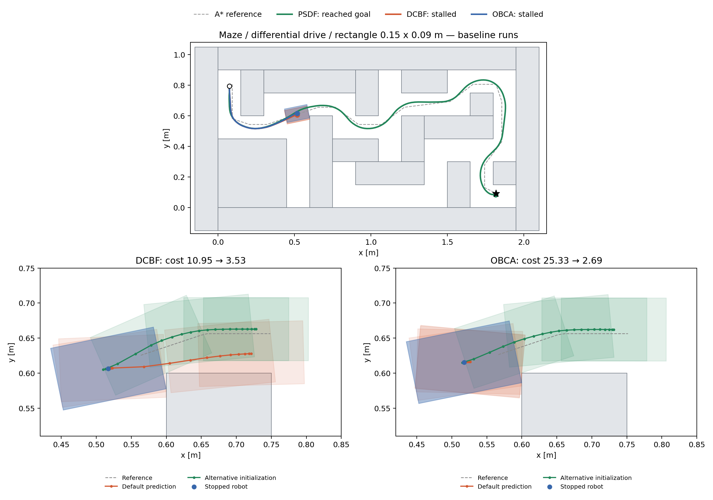

maze / DD / rectangle 실험 및 정체 원인 (2026-09-10)

PSDF는 도착했다. DCBF와 OBCA는 첫 번째 중앙 장애물의 왼쪽 위 모서리 앞에서 정체했다. 두 제어기 모두 완료된 최적화는 전부 성공 상태였지만, 정지하는 국소해를 반복했다. 같은 상태·참조·목적함수·제약에서 초기값만 바꿔 더 낮은 비용의 이동 가능한 해를 얻어 이를 재현했다.

소스: `65b8b6f37408873e2638b3e20ea01c5be5b46bbd`. 저장소의 제어기, 시뮬레이터, 기본 설정 파일은 수정하지 않았다. 새 실행기와 진단 파일만 이 폴더에 추가했다. 이전 날짜의 실험 결과를 재사용한 표가 아니다.

조건: `test_nmpc.build_parser()` / `run_single_test()`를 호출, maze, differential_drive, rectangle 0.15 × 0.09 m, A* + LoS, 시작 교란 및 위치 추정 오차 없음. 시작 자세 (0.075, 0.795, −π/2), dt=0.1 s, horizon=20. Q=diag(50,50,1), R=diag(5,0.05), terminal_weight=1, |v|≤0.6 m/s, |ω|≤1 rad/s. 안전 마진 DCBF/OBCA=0.0001 m, PSDF의 d_safe+gamma_s=0.000537 m. 각 방법 한 번의 nominal 실행이다.

| 방법 | 주행 결과 | 기록된 시뮬레이션 시간 | A* 종점까지 거리 | 최소 외곽 간격 | 완료된 solver 성공 / 호출 |
|---|---|---:|---:|---:|---:|
| DCBF | 정체 확인 후 진단 종료 | 36.9 s | 1.3988 m | 0.168 mm | 369 / 369 |
| PSDF | 도착 | 16.8 s | 0.0093 m | 1.586 mm | 168 / 168 |
| OBCA | 정체 확인 후 진단 종료 | 19.6 s | 1.4020 m | 0.169 mm | 196 / 196 |

최대 시간은 60초로 설정했지만 DCBF/OBCA는 장시간 정체와 원인이 확인된 후 SIGINT로 조기 종료했다. 원시 status는 `interrupted`이며 60초 `timeout`이 아니다. 마지막 5초간 변위는 DCBF 2.220e-16 m, OBCA 0.000e+00 m이다. 최종 위치의 10 µm 이내에 머무르기 시작한 시점은 각각 6.8 s, 6.9 s이다. 중단 당시 진행 중이던 호출의 `NonIpopt_Exception_Thrown`은 SIGINT 때문에 발생했으며 정체의 원인이 아니다. `stop_record.json`과 각 `run.log`에 기록했다.

DCBF 원인과 검증

- `control/dcbf_optimizer.py:12`의 `horizon_dcbf=10`과 147행 반복문 때문에 상태 x[1]~x[10]에만 충돌 제약을 건다. 추종 비용은 전체 horizon=20에 적용한다. 최종 정체 상태 (0.517293, 0.606383, 0.203223)에서 기본 해는 첫 입력이 사실상 0이고 예측 상태 x[11]~x[20]은 장애물과 겹친다. 제약이 없는 후반 예측으로 추종 비용을 낮추는 정지 해를 반복하는 구조다. 이는 실제 기록된 로봇 궤적의 충돌과 구분해야 한다.
- `add_warm_start()`(197행)는 한 번 계산한 정지 자세와 입력을 모든 단계에 반복한다. `setup()`(204행)은 매번 `ca.Opti()`를 새로 만들며 이전 해를 옮겨 재사용하지 않는다. 179~181행은 현재 자세의 듀얼 해를 모든 단계에 반복하고 omega=0.1로 초기화한다.
- 정확한 최종 상태·입력·참조를 다시 풀었다. 기본 해 비용 10.951533, 첫 입력 ≈(0,0). 제약을 20단계로 늘리기만 하면 예측 충돌은 없어지지만 비용 25.260344, v=-0.0000516, ω=0.0017470로 여전히 거의 정지한다. 따라서 horizon 확대만으로 정체 해결을 주장할 수 없다.
- 별도 20단계 제약 계산에서 얻은 움직이는 해의 상태·입력·듀얼 변수 초기값을 원래 10단계 문제에 옮겨 다시 풀면 비용 3.534356로 67.73% 감소한다. 첫 입력은 v=-0.074731 m/s, ω≈1 rad/s이고, 예측 외곽 최소 간격은 0.128 mm이다. 동일한 원래 제약에서 최대 위반 9.99e-09, solver `Solve_Succeeded`. 전달한 초기값 자체도 최대 위반 9.99e-09로 수치 허용 오차 내에서 feasible했다. 단순히 상태·입력 초기값만 바꾼 여러 시도는 기본 정지 해로 돌아갔다.
- 이 결과는 원래 문제가 이동 불가능한 문제가 아니라 더 나쁜 국소해에 갇힌다는 직접 증거다. 짧은 충돌 제약 구간은 추가로 잘못된 후반 예측을 허용한다.

OBCA 원인과 검증

- 정체 위치는 (0.517401, 0.615468, 0.199484)이며 DCBF와 같은 장애물 index 4, x∈[0.60,0.75], y∈[0,0.60] 옆이다. 기본 초기화 구조는 DCBF와 같다(`control/obca_optimizer.py:179`, `:197`, `:204`).
- 정확한 최종 상태·입력·참조에서 기본 초기화는 비용 25.331631, 첫 입력 ≈(0,0)을 반환했다. 동일한 목적함수·제약에서 초기 추정 궤적을 전진·좌회전 방향으로 바꾸기만 하면 비용 2.686150로 89.40% 감소했다. 최적해의 실제 첫 입력은 후진 v=-0.025586 m/s, ω≈1 rad/s이다.
- 대안 해의 예측 최소 간격 0.135 mm, 최대 제약 위반 9.97e-09, solver `Solve_Succeeded`. 정지 상태에서도 움직이는 feasible 해가 존재하므로 기본 초기화의 국소 수렴 문제로 진단한다.
- 현재 **rectangle 경로의 OBCA 구현은 DCBF와 같은 감쇠식** `omega * gamma**(i+1) * (cbf_curr-margin) + margin`을 사용한다(169행). 두 파일의 rectangle 동작 차이는 기본 제약 horizon 10 대 20이다. 거리만 제한하는 차이는 사용되지 않는 point-to-convex 경로에 있다. 따라서 이번 결과를 서로 다른 순수 DCBF/OBCA 수식의 비교로 해석하면 안 된다.

공통 참조와 판정

- A*는 maze에서 0.03 m margin으로 중심점 경로를 만들고, ConstantSpeedTrajectoryGenerator는 0.05 m 앞에서 시작하는 0.1 m/s 참조를 만든다. 정체 시 사각형을 참조 자세에 놓으면 겹침이 생기는 참조 인덱스는 DCBF [0, 1, 2, 3, 4, 5, 6, 7, 8, 9], OBCA [0, 1, 2, 3, 4, 5, 6, 7, 8, 9]이다(0부터 시작). 추종 참조가 footprint 관점에서 그대로 실행 가능하지 않다는 보조 요인이다. PSDF가 같은 전역 경로를 통과했으므로 이것만을 단독 실패 원인으로 보지는 않는다.
- 완료된 실제 주행 상태를 0.1초마다 다각형 거리와 맵 경계로 검사했을 때 세 방법 모두 접촉/겹침 0회다. 이 검사는 샘플 사이 연속 시간의 무충돌 보증은 아니다.
- 도착 판정은 원래 환경 goal (1.8,0.09,0) 대신 A* 종점 (1.81875,0.09375)까지 거리≤0.01 m이다. A*는 x/y만 반환하므로 최종 yaw는 판정하지 않는다. PSDF의 원래 goal까지 거리는 15.817 mm이며 yaw=0.015552 rad이다. 여기서 성공은 현재 코드의 판정 기준을 뜻한다.

개선 우선순위

1. 이전 최적 상태·입력과 충돌 제약의 듀얼 변수를 한 단계 옮겨 초기값으로 재사용하고, 정체하면 회전·후진 등을 포함한 여러 초기값을 비교한다. DCBF의 진단에서는 듀얼 변수까지 전달하는 것이 차이를 만들었다.
2. DCBF의 충돌 제약을 전체 예측 구간으로 확장한다. 단독 적용으로 정체가 해결되지는 않았지만 후반 예측 충돌은 제거됐다.
3. solver 성공과 별도로 진행량/정체를 검사하고, 충돌 없는 footprint 참조를 마련한다. `trial_failure_criteria`는 기존 코드에 있지만 기본 설정에서는 비활성이다.
4. OBCA를 별개 알고리즘으로 비교하려는 목적이라면 rectangle 제약에 DCBF 감쇠식이 남아 있는 것이 의도인지 확인한다.

이번에는 제어기 수정이나 대안 초기화로 전체 미로 완주 검증을 하지 않았다. 위 대안 결과는 동일한 정체 상태에서의 단일 MPC 최적화 검증이다.

실행 환경과 재현 파일

WSL Ubuntu 20.04, Python 3.8.10, NumPy 1.24.4, PyTorch 1.13.1+cpu, CasADi 3.7.1, 기존 acados/l4casadi 설치를 사용했다. 저장소 권장 Python은 3.10+지만 현재 solver 의존성은 3.8에 있어 실행기에서 설치된 Python 3.10 argparse의 BooleanOptionalAction만 가져왔다. 제어 로직에는 관여하지 않는다. OMP/OpenBLAS/MKL은 각 1스레드, ACADOS_SOURCE_DIR=/home/taek111/projects/acados.

제어 호출 중앙값: PSDF 0.264 s, DCBF 1.268 s, OBCA 2.397 s. 이 실행의 모든 완료 호출이 dt=0.1 s보다 길었다. 세 baseline과 짧은 진단 작업이 CPU를 공유했으므로 별도의 엄밀한 성능 벤치마크로 해석하지 않는다. 시뮬레이션은 계산 시간 동안 실제 상태를 진행시키지 않으므로 계산 지연은 이번 정체의 직접 원인이 아니다.

- `run_experiment.py`: test_nmpc 단일 실험 API를 실행하고 원시 궤적을 보관. WSL 저장소 루트에서 `python3 debug_runs/maze_dd_rectangle_20260910/run_experiment.py`. 진단용 SIGINT는 실행기가 자동 재현하지 않으므로 다시 실행하면 최대 60초까지 계속한다.
- `analyze.py`, `make_artifacts.py`: 원시 기록의 외곽 거리·진행량 분석과 보고서/그림 생성.
- 각 방법의 `config.yaml`, `run.log`, `result.json`, `diagnostics.json`, `diagnostics.npz`, `clearance.csv`, `data/`에 실행 기록.
- `probe_stall.py`: 저장된 정체 상태로 비용·제약·초기값 비교. DCBF의 `probe_default_full_constraint_horizon_own_feasible_safe_seed_final.json`, OBCA의 `probe_default_forward_left_final.json`이 최종 정확한 replay 결과. 다른 probe JSON은 초기 진단과 초기값 구성의 증거이며 `state_source`에 출처를 명시했다.
